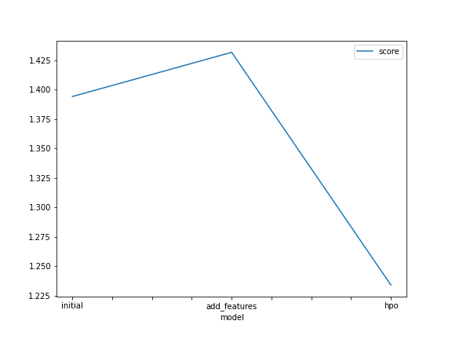
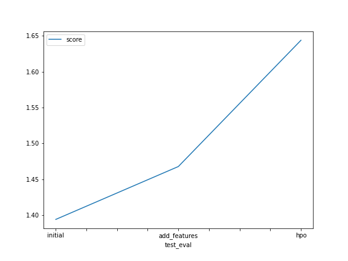

# Report: Predict Bike Sharing Demand with AutoGluon Solution
#### NAME HERE

## Initial Training
### What did you realize when you tried to submit your predictions? What changes were needed to the output of the predictor to submit your results?

#### We had to analyze the `predictions` series to see if there are any negative values
#### Then we had to count how many negative values do we have?
#### Finaly we had to set them to zero

### What was the top ranked model that performed?
#### The final model, which included hyperparameter optimization

## Exploratory data analysis and feature creation
### What did the exploratory analysis find and how did you add additional features?

#### We had to create a histogram of all features to show the distribution of each one relative to the data.
#### We used Data Cleansing and Feature Engineering to extract year, month, and day into separate columns

### How much better did your model preform after adding additional features and why do you think that is?
#### The score increased from 1.39422 to 1.46785

## Hyper parameter tuning
### How much better did your model preform after trying different hyper parameters?
#### The score increased from 1.46785 to 1.64363

### If you were given more time with this dataset, where do you think you would spend more time?
#### I would spend more time on Hyper parameter tuning

### Create a table with the models you ran, the hyperparameters modified, and the kaggle score.
|model|hpo1|hpo2|hpo3|score|
|--|--|--|--|--|
|initial|?|?|?|?|
|add_features|?|?|?|?|
|hpo|?|?|?|?|

### Create a line plot showing the top model score for the three (or more) training runs during the project.

TODO: Replace the image below with your own.

### Create a line plot showing the top kaggle score for the three (or more) prediction submissions during the project.

## Summary

